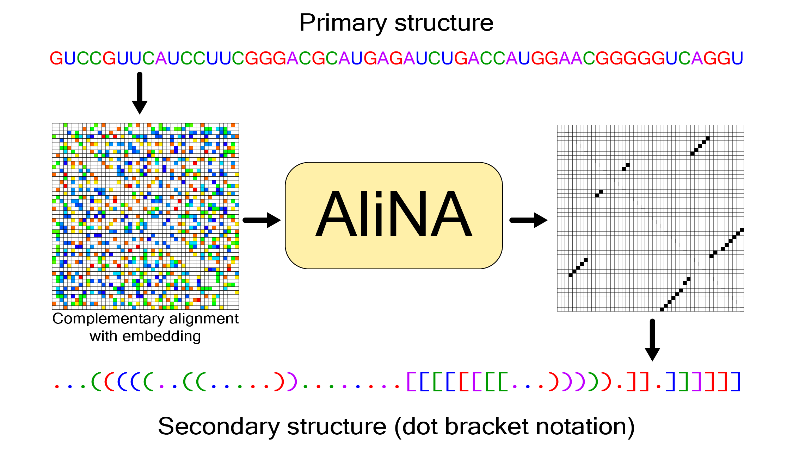
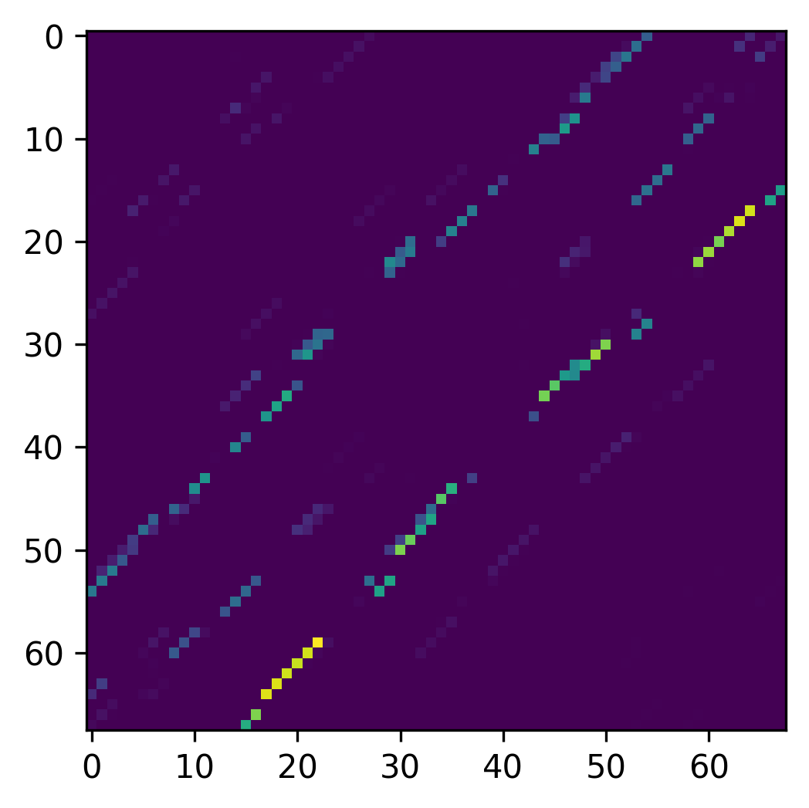
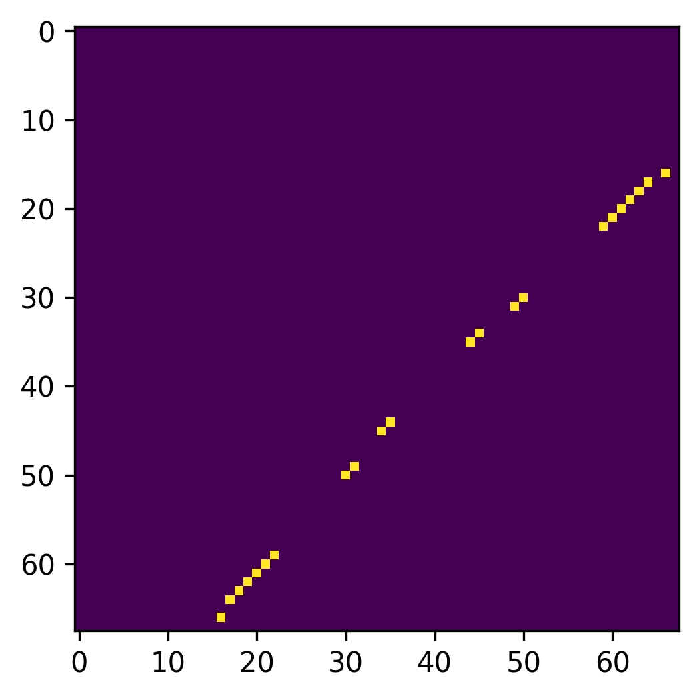

<b>This repository is no longer maintained. The latest version of AliNA will be available at</b> [https://github.com/XELARI-CORP/AliNA](https://github.com/XELARI-CORP/AliNA)

AliNA
===

(ALIgned Nucleic Acids) is an RNA secondary structures prediction algorithm based on deep learning. It is used to predict the DotBracket notation of secondary structure based on primary sequence.


Installation
===

- Download the repository and change directory: 
    ```
    git clone https://github.com/Arty40m/AliNA.git
    cd AliNA
    ```
    
- You need python version 3.8 or greater. We recommend using conda to install a particular python version in case your system is below 3.8. 

- Create virtual environment:

    - Using pip:
    ```
    python3 -m venv Alina_venv
    . Alina_venv/bin/activate
    ```
    - Using conda:
    ```
    conda create --name Alina_venv python=3.10
    conda activate Alina_venv
    ```
- Install AliNA as an editable package:
    ```
    python3 -m pip install -e .
    ```
- PyTorch is required for AliNA to work. It is not installed automatically, since you have to specify your CUDA version and operating system. See the official [install](https://pytorch.org/get-started/locally/) page for more detail. Stable PyTorch version for AliNA is 1.11. If GPU usage is not important for you, just try:

    ```
    python3 -m pip install torch==1.11
    ```
- Test AliNA:
    ```
    python3 -m pip install -e .[dev]
    pytest tests --verbose
    ```

Usage
===

AliNA can be used from console (CLI) and as a python package (API).
    
<h2>CLI</h2>

__Quick example:__

```
- RNA sequence
    alina -i GGAGCAUUACCCCCCCAAAACCCUGGGGAUACAGGGCCCA
- Fasta file
    alina -m file -i path_to_file.fasta -o path_to_prediction_file.out
```

```
alina [-h] [-m {seq,file}] -i <Sequence or Fasta file> [-o <Output file>] [-th <Threshold value>] [--gpu] [--skip-errors] [--no-warn]
```
**-m, --mode**  - prediction mode: "seq" - for single sequence typed in the command. "file" - for multiple predictions from .fasta file.

**-i, --input** - input sequence or path to fasta file.

**-o, --out** - path to the output file for "file" mode. Default - Prediction_(input file name).

**-th, --threshold** - specifies the sensitivity threshold when processing predictions **[0, 1]**. The lower the threshold the more bonds will be included into the predicted structure. Unless specified explicitly, the default value is 0.5.

**--gpu** - run model using GPU if CUDA is available. Default - run on CPU only.

**--skip-errors** - Skip invalid sequences instead of raising SequenceError. Default - False.

**--no-warn** - Do not raise warning on invalid sequnce skip. Default - False.

**-h, --help** - show help message.

<h2>API</h2>
    You can import AliNA as a python package and use its API to predict secondary structure in different forms - as a dot bracket or matrix of raw model probabilities. Arguments specified in command line can be passed into class constructor:
    
```
import alina

Alina = alina.AliNA(skip_error_data = False,
                    warn = True,
                    gpu = False)
                
struct = Alina.fold('UAGCGUAGGGGAAACGCCCGGUUACAUU')
struct
>>> .((([[.(((......))).)))]]...

struct = Alina.fold('UAGCGUAGGGGAAACGCCCGGUUACAUU', threshold = 0.7)
struct
>>> ..((.....(......)...))......

structs = Alina.fold(['CUCUACUUACGGCGCUAAUAAAAAAGCGUUACGUUUU', 'AAAAAAAAAAAAAUUUUUUUUUUUUU'])
structs
>>> ['........((((((((........)))))..)))...', '((((..................))))']
```
    
To get indexes of complementary pairs:

```
struct = Alina.fold('UAGCGUAGGGCCCGGUUACAUU')
struct
>>> ....((((.......))))...

alina.utils.get_na_pairs(struct)
>>> [(7, 15), (6, 16), (5, 17), (4, 18)]
```

To obtain probabilities and processed quantized matrix:
    
```
import matplotlib.pyplot as plt

s, p = Alina.fold('GUUUCGGUGGUCAUAGCGUAGGGGAAACGCCCGGUUACAUUUCGAACCCGGAAGCUAAGCCUUACAGC', 
              with_probs=True)
s
>>> ................(((((((.......((..((........))...))........)))))).).

plt.imshow(p)
```



```
q = alina.utils.quantize_matrix(p, threshold = 0.5)
plt.imshow(q)
```



<h2>Cite this work</h2>

- Nasaev, S., Mukanov, A. R., Kuznetsov, I. I., Veselovsky, A. V. (2023). AliNA – a deep learning program for RNA secondary structure prediction. Molecular Informatics. https://doi.org/10.1002/minf.202300113
